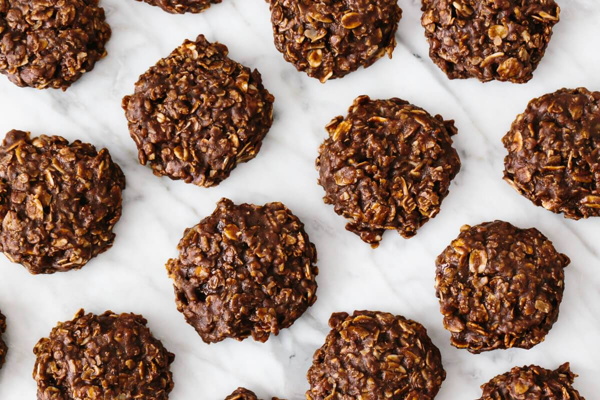

# No Bake Cookies

Yield: **2-3 Dozen**

## Ingredients

Measure|Ingredient
---|---
2 Cups|Sugar
3 T|Cocoa
3 Cups|Oatmeal
1/2 Cup|Margarine *(1 Stick)*
1/2 Cup|Chocolate Chips
1/2 Cup|Milk
1 T|Vanilla

## Instructions

1. Stir together sugar and cocoa until well blended. Set aside.
2. Spread out 2-3 feet of wax paper on counter.
3. Measure out oatmeal, at least one cup at the ready, and set aside.
4. Melt margarine in large, deep pan over medium heat.
5. Add chocolate chips, stirring frequently until melted.
6. Add milk, continuing to stir frequently.
7. When mixture reaches a boil, continue for 3 minutes, stirring constantly.
8. Remove from heat.
9. Stir in 1 cup of oatmeal at a time.
10. When well blended, add in vanilla.
11. Drop by tablespoon onto wax paper and let cool.
12. Store covered.