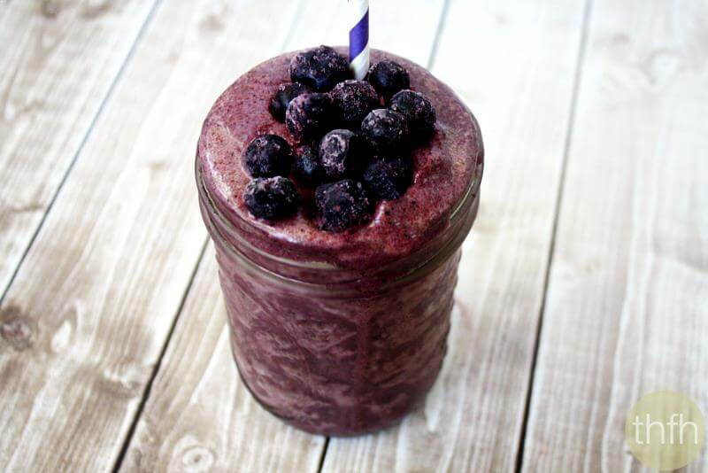

# Açai Smoothie

Yield: **50-60 oz (4 Servings)**
Prep: **5 min**

## Ingredients

Measure|Ingredient
---|---
3.5 oz|Açai *Pureed*
1 cup|Water *Use a bit more than a cup of ice instead if you want it colder*
1 cup|Almond Milk *Unsweetened Vanilla (30 cal)*
1/8 cup|Maple Syrup
1 t|Cinnamon Powder
1/4 t|Cloves *Ground*
16 oz|Yogurt *Silken*
3 whole|Bananas

## Instructions

1. I use frozen packets of Açai and accordingly the first step is to thaw the puree in that case.
2. Add all ingredients to a blender.
3. Blend until smooth.
4. Refrigerate leftovers, but remember to shake a bit before drinking as ingredients will tend to separate over time.