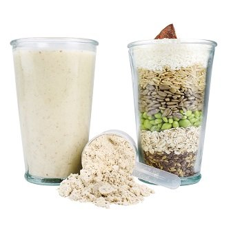

# Huel Morning Shake

Yield: **1 Servings**
Ready In: **5 min**

## Ingredients

Measure|Ingredient
---|---
100 mL|Apple Raspberry Juice
50 mL|Tart Cherry Juice
300 mL|Almond Milk *unflavored, unsweetened*
1 Measure|Huel *unflavored, unsweetened, using included measuring cup*
1/2 t|Matcha Powder
2 T|Collagen Powder
2 T|Peanut Powder *unsweetened*
1 t|Acai Powder
2 t|Adaptogens
2 T|Carob Powder
1 T|Matcha Powder

## Instructions

1. Combine all ingredients in Huel Shaker
2. Shake