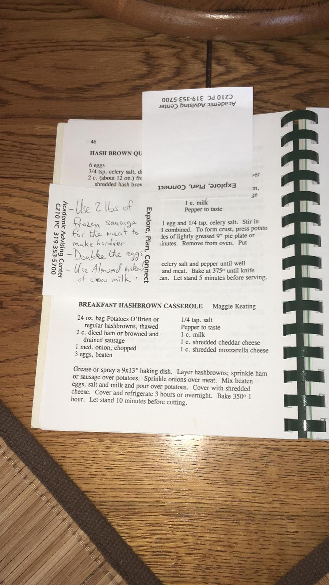

# Aunt Maggie's Breakfast Casserole

Yield: **6-8 Servings**

## Ingredients

Measure|Ingredient
---|---
24 oz bag|Potatoes O'brien
2 Cup|Diced Ham or Browned and Drained Sausage *vegan sausage is fine, and doesn't need browning, but does need spice like fresh chopped jalapeños*
1 Medium|Onion *chopped*
3 Large|Eggs *beaten*
1/4 t|Salt
To taste|Pepper
1 Cup|Milk *almond is fine*
1 Cup|Shredded Cheddar Cheese *daiya is fine*
1 Cup|Shredded Mozzarella Cheese *daiya is fine*

Notes: **In the Dibbern Family, we adjusted the recipe such that we skip the onion, double the eggs at a minimum, use 2 lbs of frozen suasuage for the meat to make it hardier, use only cheddar cheese, and almond milk.**

## Instructions

1. Grease or spray a 9x13" baking dish.
2. Layer potatoes, sprinkled sausage or ham over potatoes.
3. Mix beaten eggs, salt, and milk, pour over potatoes.
4. Cover with shredded cheese.
5. (Optionally) cover and refrigerate 3 hours or overnight.
6. Bake at 350°F for 1 full hour (note that the Daiya cheese appears to require no modifications to timing).
7. Let stand 10 minutes before cutting.

## Notes

This recipe was shared with the family's church, and my dad customized it over the years to match our tastes. It was originally shared by my Great Aunt Maggie Keating (wife of my mom's mom's older brother a former fire chief from Iowa City where I grew up). I tried this recipe out myself a few weeks before her passing in 2020.

