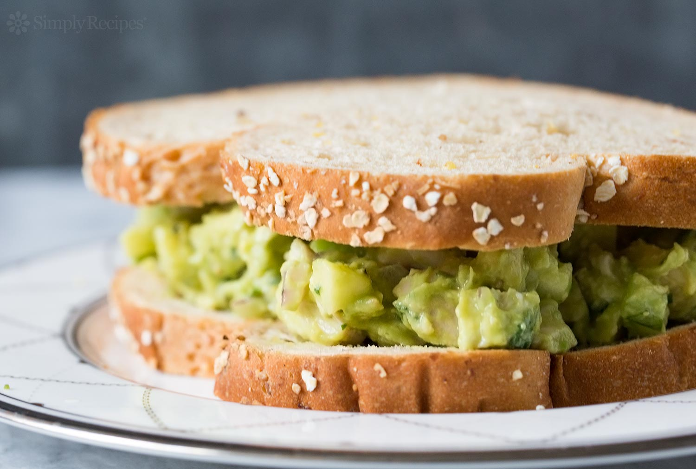

# Avocado Chicken Salad

Yield: **1-2 Servings**
Prep: **5 min**
Cook: **30 min**
Ready In: **35 min**

## Ingredients

Measure|Ingredient
---|---
1 Large|Avocado
1 Regular|Chicken Breast
To taste|Salt
To taste|Black Pepper
To taste|Garlic Powder

Note: **You can easily multiple this recipe to prepare more in advance.**

## Instructions

1. Cook the chicken breast(s) in an instant pot to the point where they're easily shredded. Usually this is around 15 minutes at high pressure.
2. Shred the chicken and allow to cool slightly.
3. Halve and slice avocado(s).
4. Add avocado, chicken, and spices to bowl.
5. Mash and mix until smooth throughout.
6. Serve on a tortilla, as part of a sandwich, or whatever you'd like!