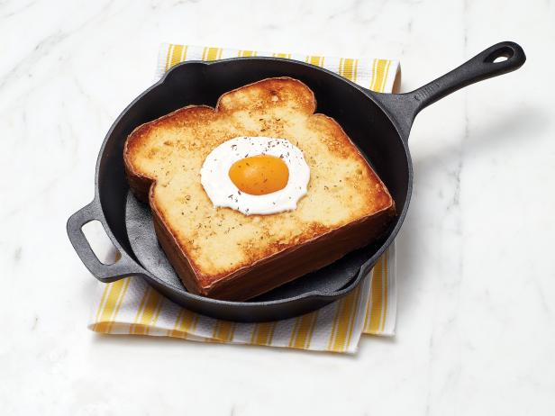

# Egg-in-the-Hole

Yield: **1 (1 Serving)**
Prep: **5 min**
Cook: **5 min**
Ready In: **10 min**

## Ingredients

Measure|Ingredient
---|---
1 Large|Egg
1 Slice|Bread *heartier the better, potato, sourdough*
To taste|Butter *use enough butter to coat your frying pan*

## Instructions

1. Place the piece of bread in the buttered frying pan.
2. Use a small cup or something similar to cut out the center portion of the piece of bread. I like to save the center portions and toast them at the end and then spread them with something sweet like apple butter.
3. Crack an egg and place it inside the hole in the toast.
4. Fry the egg as you would normally on medium to low heat. You have to balance toasting the bread and cooking the egg.
5. When the egg and toast are both cooked, remove from pan and serve.
6. (Optional) add some frank's hot sauce to the top of your toast