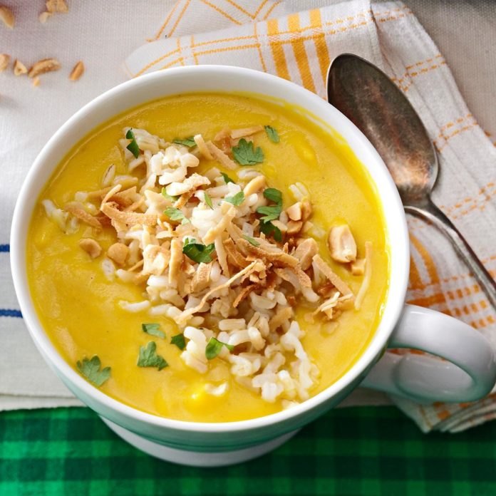

# Ginger Butternut Squash Bisque

Yield: **6 Servings**
Prep: **25 min**
Cook: **40 min**
Ready In: **1 hr 5 min**

## Ingredients

Measure|Ingredient
---|---
1 Medium|Butternut Squash *about three pounds*
1 T|Olive Oil
2 Medium|Carrots *peeled and chopped*
1 Medium|Onion *chopped*
2 Cloves|Garlic *fresh chopped*
2 t|Ginger *fresh paste*
2 1/2 T|Yellow Curry Powder
1 Can|Vegetable Broth *chicken broth is fine*
1 Can|Coconut Milk
1 t|Salt
1 t|Pepper
2 Cups|Brown Rice *hot, cooked*
1/4 Cup|Peanuts *salted and coarsely chopped*
To taste|Chili Garlic Sauce *roughly 1/2 T recommended*

## Instructions

1. Preheat oven to 400°F.
2. Cut squash lengthwise in half, remove and discard seeds.
3. Plae squash in a greased shallow roasting pan, cut side down.
4. Roast 40-45 minutes or until squash is tender. Cool slightly.
5. In a large stockpot, heat oil over medium heat.
6. Add carrots and onion, cook and stir until tender.
7. Add garlic, ginger, chili garlic sauce, and curry powder.
8. Cook and stir 1 minute longer.
9. Add broth and bring to a boil.
10. Reduce heat, simmer uncovered 10-12 minutes or until the carrots are tender.
11. Scoop pulp from squash, discard skins.
12. Add squash, coconute milk, salt, and pepper to carrot mixture.
13. Bring just to a boil, stirring occasionally.
14. Remove from heat, cool slightly.
15. Process in batches in a blender until smooth, or use an immersion blender.
16. Return to pan, heat through. Top servings with rice, coconut shreds (optional), peanuts, and cilantro (optional).