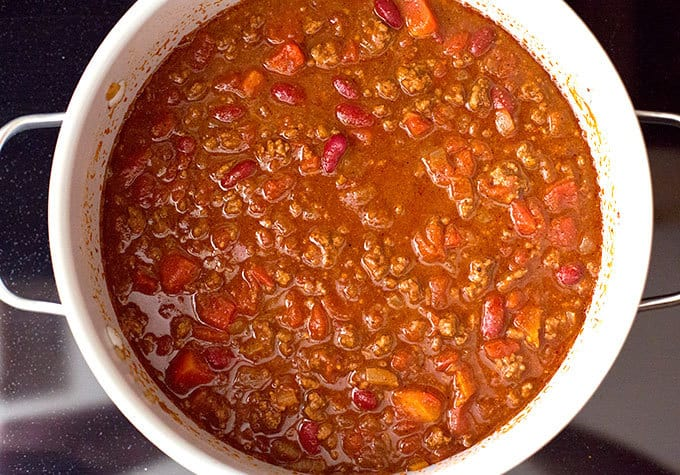

# Grandpa Dibbern's Famous Chili

Yield: **4-6 Servings**

## Ingredients

Measure|Ingredient
---|---
1 Can|Hot Chili Beans
1 Can|Stewed Tomatoes *these usually have additional spice which is key*
1 lb|Ground Hamburger *turkey is fine though flavor definitely changes*
12 oz|Tomato Juice *add more or less for desired thickness*
1 Package|Chili Mix *if you want it spicier*

Note: **For every can of beans you need a can of stewed tomatoes if you want to increase the recipe.**

## Instructions

1. Brown your choice of meat in a pan.
2. Puree or smash stewed tomatoes.
3. Add all ingredients to pan and cook for 20-30 minutes, stirring occassionally.