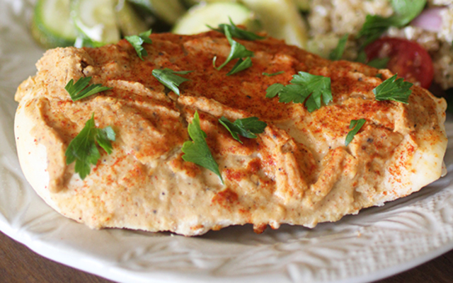

# Hummus Crusted Chicken and Veggies

Yield: **4 Servings**
Read In: **45 minutes**

## Ingredients

Measure|Ingredient
---|---
4|Chicken Breasts *can be frozen*
2 Large|Tomatoes
2 Medium|Zucchini
1/2 Medium|Onion
2 Cloves|Garlic *fresh chopped*
1 Small Package|Hummus *plain*
To taste|Cajun Seasoning
To taste|Grapeseed Oil *olive is fine, but watch the smokepoint when choosing cooking temperature*
To taste|Salt
To taste|Black Pepper

## Instructions

1. Preheat oven to 450°F.
2. Add alumnium foil to an 8x8" baking dish.
3. Coat foil with oil.
4. Layer up the veggies, adding one zucchini, then one tomato, then one quarter onion before repeating. For each layer, add seasoning to taste but be generous. Drizzle each whole vegetable layer with a bit of oil.
5. Add chicken breasts, frozen or otherwize, to the top of the dish.
6. Coat the top of each chicken breast with a reasonably thick layer of hummus.
7. Add a dash of cajun seasoning to the top of each chicken breast.
8. Put entire dish in the oven and cook for roughly 30-40 minutes. The dish is done when the chicken has reached 165°F internally. I'd say check after about 25 minutes and then every 5-10 minutes from there.