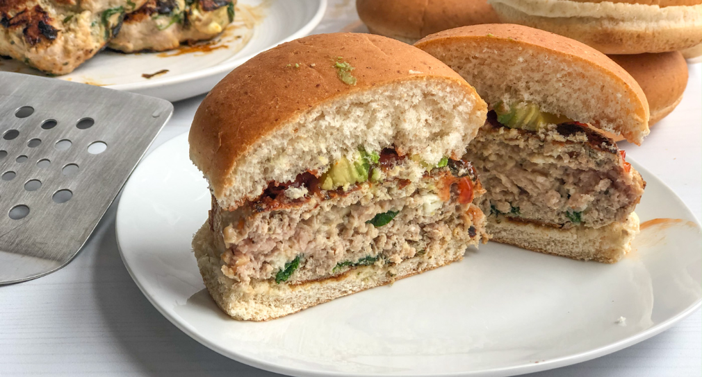

# Mediterranean Turkey Burgers

Yield: **4 Burgers (4 Servings)**
Prep: **5 min**
Cook: **12 min**
Ready In: **17 min**

## Ingredients

Measure|Ingredient
---|---
1.25 lbs|Turkey *Ground*
2-3 oz|Feta
1/2 cup|Spinach *Chopped*
1 1/2 t|Sumac
1/2 t|Black Pepper *Ground*
1/4 t|Cloves *Ground*
1/2 t|Onion *Powdered*
1/2 t|Cinnamon
1 t|Basil *Chopped*

## Instructions

1. Add feta and spices to medium mixing bowl
2. Chop spinach, add to mixing bowl
3. Add ground turkey to bowl and mix thoroughly
4. Portion ground turkey into four patties
5. Grill as you would a normal Turkey Burger. For me, about 12 minutes. Internal temperature should be 165°F.