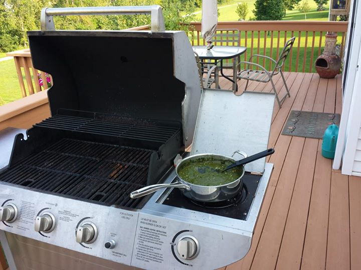

# Palak Paneer

## Ingredients

Measure|Ingredient
---|---
16 oz|spinach *frozen*
1 cup/block|Paneer
1 large|Tomato *chopped*
1 medium|Red Onion *diced*
1 t|Garam Masala *(hot spice)*
1/2 cup|Frozen Peas *optional*
1 T|Greek Yogurt *nonfat, plain*
1 T|Olive Oil
1-2 t|Garlic *fresh paste*
1-2 t|Ginger *fresh paste (use garlic press)*
To taste|Salt

## Instructions

1. Cut paneer into 1 cm cubes, and optionally pan fry on all sides (helps it hold together, and gives a nice crunchiness to the sides).
2. Boil spinach with 1 cup of extra water + salt (to taste) until spinach looks like it will disintegrate in the blender. Do not drain - you need the water. Blend until liquefied.
3. Saute garlic and ginger paste in olive oil in a large wok until garlic is a golden brown
4. Add chopped onions to the wok, and saute until translucent
5. dd tomato, and cook til just slightly soft
6. Pour in liquefied spinach, and mix well
7. Add peas and chili powder, and cook for a few minutes, esp. if peas still frozen
8. Add paneer, garam masala, and greek yogurt, and stir 'til well mixed.
9. Let simmer another minute or two, and serve with any indian bread or rice (some are healthier than others).
10. Making the paneer: enough paneer for this recipe can be made using 1/2 gal *NON-HOMOGENIZED* whole milk, 1/4 cup of lemon juice, and cheese cloth. Bring the milk to a boil, stirring frequently. Once you reach a boil, turn off the heat, and mix in the lemon juice. Give a quick stir, and let sit for a few minutes. Once the lemon juice has done it's work, the milk will be clear with a slight pale yellow tint, with big white chunks of paneer floating in it. Strain the chunks into the cheese cloth, wrap, and then press between two plates, with at least 15-20lbs of weights on top. Let sit for 15 minutes. Ideally, refrigerate 1 hr after this, to firm up the paneer. You can save the whey (the pale clear bi-product) and use it to make oatmeal and such. It's very proteinaceous.