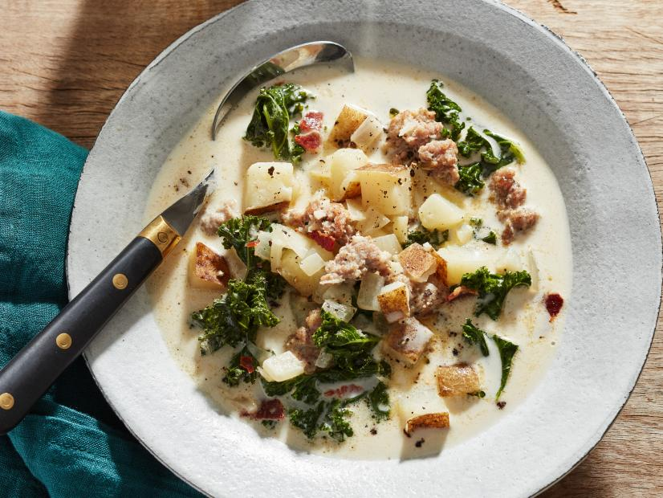

# Zuppa Toscana

Yield: **4-6 Servings**
Ready In: **1 hr**

## Ingredients

Measure|Ingredient
---|---
1 lb|Italian Sausage *hot/spicy*
3 Large|Potatoes *russet, unpeeled*
1 Small|Onion *chopped*
4 Cloves|Garlic *chopped*
3 Cups|Kale *veins removed, tin sliced to ribbons*
32 oz|Chicken Broth *low-sodium preferred*
2.5 Cups|Water
1 1/4 Cups|Half and Half

## Instructions

1. Remote hot sausage from package, casings.
2. Brown sausage in skillet.
3. Place cooked sausage in stockpot.
4. Cook onions (and optional 4 slices chopped bacon)
5. Add to stockpot.
6. Slice potatoes, leaving skin on, lengthwise and then into 1/4" thick triangles.
7. Add pototoes, chicken broth, water, garlic, to stock pot.
8. Bring to boil and cook for about 30 minutes or until potatoes are tender.
9. Add kale ribbons and half and half, then let simmmer for 15 more minutes until kale is tender.
