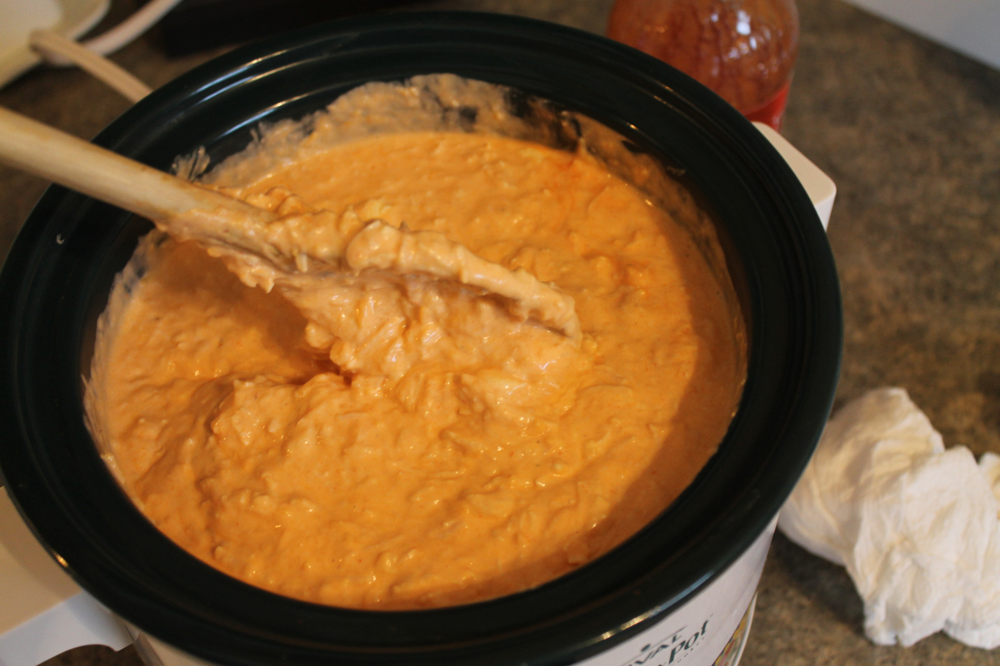

# Buffalo Chicken Dip

## Ingredients

Measure|Ingredient
---|---
1 8oz Package|Cream Cheese
1-2 cans|White Meat Chicken
1 cup|Buffalo Sauce
1 cup|Ranch Dressing *(or blue cheese dressing)*

## Instructions

1. Mix all ingredients
2. Cook in crockpot, or backe at 350 degrees for 20 minutes (until bubbly)