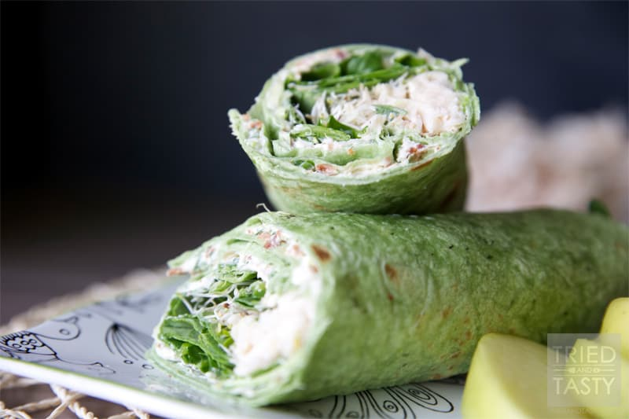

# Cream Cheese and Alfalfa Sprouts

Yield: **1 Servings**
Read In: **5 minutes**

## Ingredients

Measure|Ingredient
---|---
1 Medium|Tortilla
To taste|Cream Cheese
To taste|Alfalfa Sprouts

## Instructions

1. Warm the tortilla slightly.
2. Spread cream cheese.
3. Add sprouts.
4. Roll and enjoy!