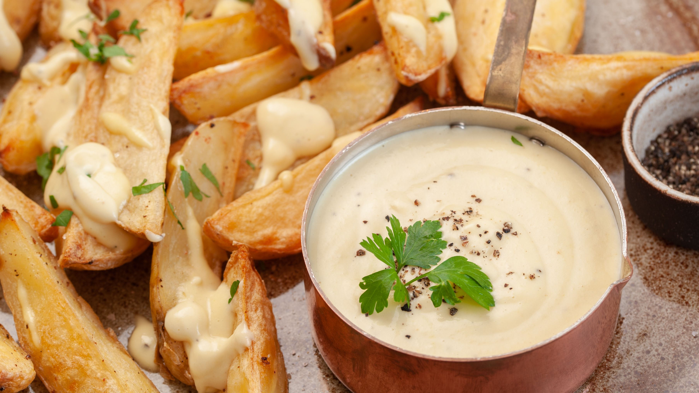

# Garlic Aioli

Yield: **1 small container**
Prep: **5 min**
Ready In: **35 minutes**

## Ingredients

Measure|Ingredient
---|---
1 Cup|Avocado Oil Mayo *avocado oil is important, adds flavor*
2 Cloves|Garlic *chopped*
1 T|Lime Juice
1 t|Salt
2 t|Black Pepper

## Instructions

1. Add all the ingredients to a small cup with a lid.
2. Mix the ingreients together, and cover.
3. Refrigerate for 30 minutes, minimum. The longer its in the fridge, the more garlic flavor you get. You can use less garlic if you're preparing a day in advance.
4. Serve and enjoy with fries, tacos, whatever!