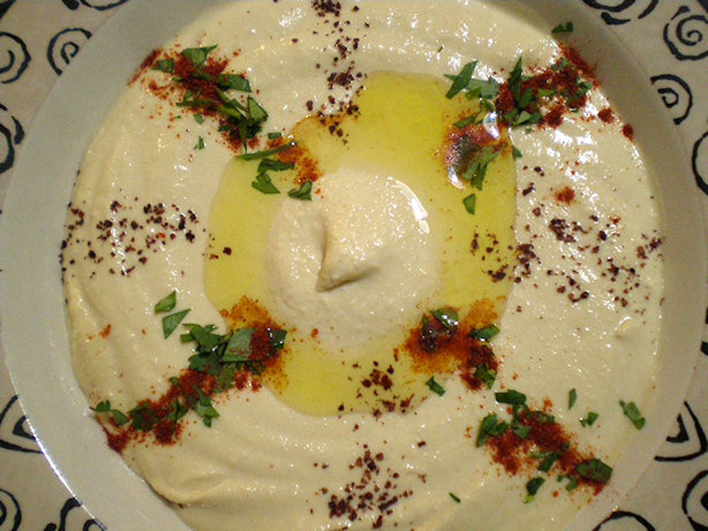

# Properly Spiced Hummous

## Ingredients

Measure|Ingredient
---|---
1 can|Garbanzo Beans (Chick Peas)
1/2 T|Sriracha sauce
1/2 t|Ground Pepper
1 t|Cayenne Pepper
1.5 t|Garlic Minced
1 t|Onion Powder
2-3 T|Lemon Juice
4 T|Tahini
1 T|Olive Oil
1/2 t|Salt

## Instructions

1. Open can of garbanzo beans and mash or blend as smooth as possible.
2. Stir in remaining ingredients, mixing until even.
3. Store in a sealed container.