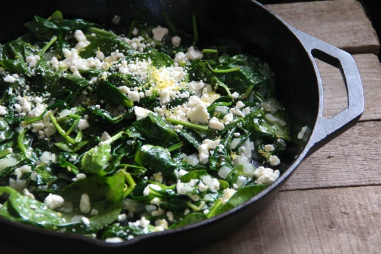

# Sauteed Zucchini and Spinach with Feta and Arils

Yield: **1/2 Cup (1 Serving)**
Prep: **5 min**
Cook: **10 min**
Ready In: **15 min**

## Ingredients

Measure|Ingredient
---|---
1/2 medium|Zucchini *Spiralized*
1/4 cup|Baby Spinach *Chopped*
2 oz|Feta Cheese *Crumbled*
1-2 oz|Pomegranate Arils
1/2 tsp|Ground Coriander

## Instructions

1. Lightly coat a frying pan with 1-2 ounces of oil, such as grapeseed oil.
2. Add spiralized zucchini, spinach, feta, and arils to pan.
3. Sautee 5-10 minutes or until feta cheese is mostly melted. Stir occasionally.

## Notes

Goes well with baked chicken and brown rice. I coated the chicken with a rub of grapeseed oil, black pepper, chili powder, onion powder, garlic powder and cinnamon.

Note that I mentioned grapeseed oil below as that is what I use in place of vegetable and/or olive oil for most recipes. It has a higher smoke point which in theory means a lower probability of trans fats being produced while cooking.